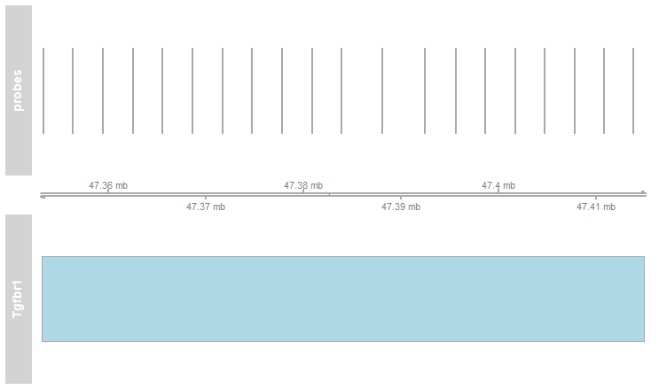
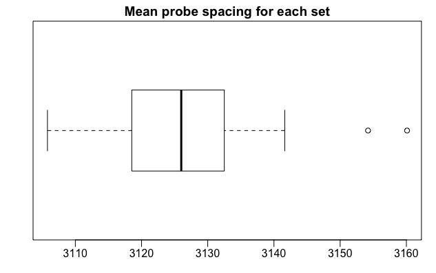
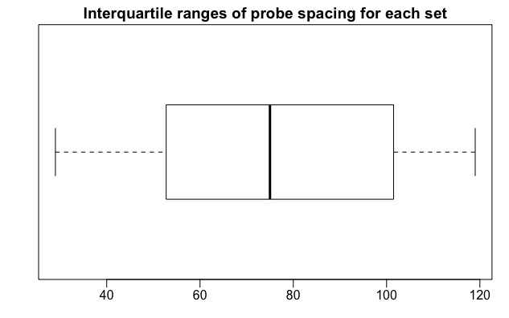

# General considerations during probe-generation

* Due to the mouse genome not being present on [Antholigo](https://antholigo.chop.edu/) for now, we are attempting to use [OligoMiner](https://github.com/beliveau-lab/OligoMiner) in its place.
* However, since OligoMiner was primarily designed for probe generation for *in situ* hybridisation applications, some of its default parameters and behaviour have to be tweaked for it to emulate Antholigo's output (to the degree to which we can manage).

Some of the considerations I am trying to pay attention to during probe generation include:

* Number - There must be sufficient number of probes to cover the region of interest.

* Melting temperature (Tm) - I am attempting to get probes that are not too far apart in Tm, since that may cause problems during PCR.

* Spacing - The probes cannot be spaced too closely together, or too far apart.
  

Getting probes which satisfy these criteria will require a degree of trial and error and optimisation.

# OligoMiner parameter selection

* Since OligoMiner was designed primarily for fluorescence *in situ* hybridisation applications, its default parameters are set for the production of FISH probes.
* For example, OligoMiner assumes an Na^+^ salt concentration of 390 mM and a formamide percentage of 50%, which are the norm for FISH. Both will affect melting temperature (Tm).
* However, as far as I can tell, PCR buffers do not contain formamide and contain only 50 mM of K^+^. K^+^ being a monovalent salt like Na^+^, we can assume that the effects of [Na^+^] and [K^+^] on Tm should be similar.
* In addition, PCR buffers may also contain Mg^2+^, as a cofactor for the polymerase. However, it is not present at a very high concentration, so I do not think it will affect Tm.
 
# OligoMiner pipeline overview

1. Using the `blockParse.py` to generate probes from the input region (Tgfbr1) to generate a `.fastq` file.

2. Aligning generated probes using `bowtie2` to create a `.sam` file (genome index has to be built first and it takes a long time).
   This will map the probes to the entire mouse genome. Some probes might map to more than just our region of interest. These are not desirable to us.

3. Removing the multi-mapped probes using the `outputClean.py` script. This produces a `BED` file with the genomic co-ordinates (start and end positions) of each of the sequences.

4. The R script `checking-chromosome-number.R` to:
    * Change chromosome nomenclature from Ensembl to UCSC
    * Modify genomic co-ordinates
    * Filter for consisten T~m~ (for further use in `structureCheck.py`)
	
	The corresponding R notebook is rendered [here](https://kkkaslikar.github.io/making-evenly-spaced-probes/checking_chromosome_number.nb.html)

5. Using the `structureCheck.py` script to check for possible secondary structures within our probes. Probes are filtered further.

6. `spacing-probes.R` to space the probes and visualise spacing. The corresponding R notebook is rendered [here](https://kkkaslikar.github.io/making-evenly-spaced-probes/spacing-probes.nb.html)

# Probe length

* Dapprich et al. used a probe length of 25 bp in their paper.
* I correspondingly tried to keep a probe length of between 19 to 25, so as not to be too restrictive, and allow some flexibility, since we want to generate sufficient probes which also account for the spacing and Tm considerations.

# Probe spacing

* Dapprich et al. used a probe spacing of 6 to 10 kb in the original paper.
* I initially tried to specify probe spacing within OligoMiner during probe generation itself, using its `space` parameter.
* I used a probe spacing of 6 kb, in order to have a better chance of pulling down our region of interest.
* However, the number of probes that remains after filtering for multimappers, T~m~ and structure is too low.
    * In addition, after all the filtering steps, the spacing of the probes becomes uneven again.
* Hence, I resorted to using a different order of operations.

# New probe generation strategy

* Produce probes **first**.
* Filter for multi-mappers = Filter for region of interest
* Filter for secondary structure
* Filter for Tm
* Filter for spacing

# Rationale behind the strategy

* Even if we solve the co-ordinate problem, we still have to account for the fact that we have to filter probes based on:

	* Multiple mapping (filter these out)
	* T~m~
	* Secondary structure
  
* If we space the probes first, applying any of the above filters *after* that may make the spacing uneven again.

* Hence, we filter for everything else first, *then* space.

# Problem caused due wrong interpretations of the probe co-ordinates output by OligoMiner

* Our probes were mapping *really* far away from our intended gene, and we just did not know why.

* At first I thought that maybe the spacing was a problem, or some of the input sequences or parameters were different or wrong.
* Finally, I realised what was the problem.

## The cause

* Oligominer's output of probes gave genomic co-ordinates **with respect to TGFβR1**, and **not with respect to the whole of chromosome 4**.

|Chromosome number|Start|End|Sequence|Tm|
|:---:|:---:|:---:|:---:|:---:|
|chr4|16|34|CGAGGAGGGGCGAGGCTTC|58.88|
|chr4|60|78|GGGCCGGGCCACAAACAGT|59.81|
|chr4|107|125|CTGCTCCACGTCGTCCGCA|59.40|

* The genome browser assumes that the co-ordinates were with respect to chromosome 4, which is why they were mapping far away.

# The solution

* Adjust the co-ordinates by 47,353,222, which is the position in mouse chromosome 4 where the gene TGFβR1 begins.

$$coordinate - 1 +  47353222$$

* New co-ordinates

| Chromosome number | Start | End | Sequence | Tm |
|:-----------------:|:-----:|:---:|:--------:|:--:|
|chr4|47353457 |47353457|AGCTCTTTCTCAAACATGGCGC|56.2 |
|chr4|47353707|47353729|CCCCTGATTCCACTGCCTAAATG|55.29|

# The implementation of the pipeline

Review of how the pipeline was implemented with a mixture of Oligominer and R scripts:

1. `blockParse.py` to create oligos
2. Align probes with `bowtie2`
3. `outputClean.py` to remove multimappers
4. `checking-chromosome-number.R` to:
    * Change chromosome nomenclature from Ensembl to UCSC
    * Modify genomic co-ordinates
    * Filter for consisten T~m~ (for further use in `structureCheck.py`)
5. `structureCheck.py` to check for secondary structure
6. `spacing-probes.R` to space the probes and visualise spacing

# The results

* 27 probe sets found, with 20 probes each

* All probes within a set paced approximately >=3000 kb apart

# Probes in the context of the surrounding genes

Before:

After (the barcode-like black bars on top of Tgfbr1 represent the probes):

# A closer look at probe spacing

# Probe spacing distribution

# Actual code for the pipeline

The actual code for the pipeline is documented [here](https://kkkaslikar.github.io/making-evenly-spaced-probes/pipeline.html)

# Future work

* Check the probes on IDT OligoAnalyser

* Experimentally test the probes
